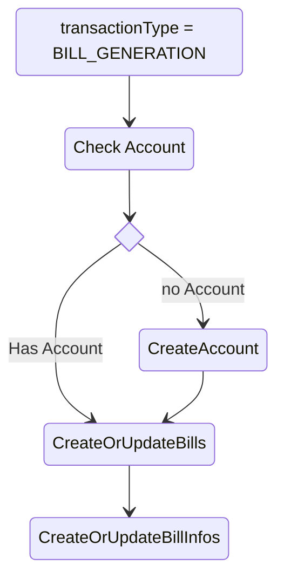
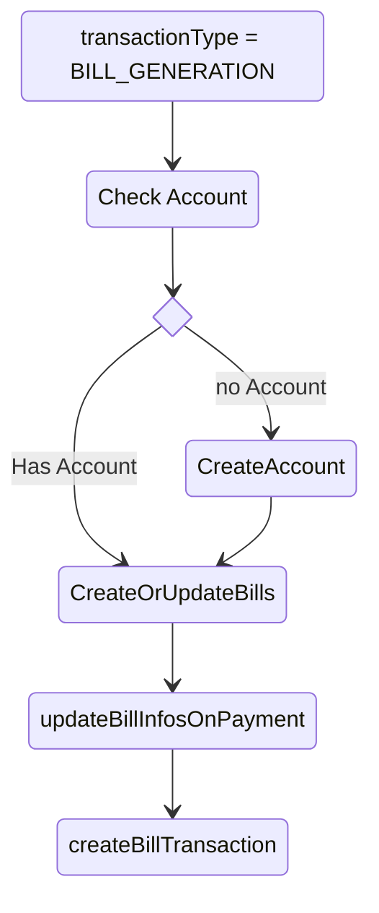

# Bill Processing

## Types of bills
Defined in ` AccountType`. These are 
1. MOBILE_BILL
2. ELECTRIC_BILL
3. GAS_BILL

Supporting types
1. LOAN
2. CREDITCARD

## BIll Transaction Types
1. BILL_GENERATION  - When a new bill gets Generated
2. BILL_INFORMATION - When there is any information for bill
3. BILL_CONFIRMATION - When a bill is paid
4. BILL_TXN_CONFIRMATION - When we get confirmation from paying entity
5. BILL_IMMEDIATE - Item (1) But due date is over
6. BILL_DUE_TODAY - Item (1) But due date is today. 

## MessageTypes
Use message type in conjunction with bill transaction types. 
1. BILL_PAYMENT - Bill Payment
2. BILL_STATEMENT - Bill Statement
3. INFORMATION - Bill Information
## Processing
### BILL_GENERATION

CreateOrUpdateBillInfos - Create a new entry here or update entry here depending on bill_date and account number
### BILL_CONFIRMATION

updateBillInfosOnPayment

1. Check if there is a bill Info in bills that is unpaid.
2. If no bill_ifos, then no changes
3. If bill_infos, then update paymentAt and return bill_infos_id

createBillTransaction
Since there is no description. Create a new description like ``${issureName} Bill Payment``
1. Check if there is a transaction for this amount in transaction ( might have got bank / credit card / wallet sms first)
2. If (1) is true, update the bill_infos_id, 
3. If no transaction, create one and link it to accountId and bill_infos_id

