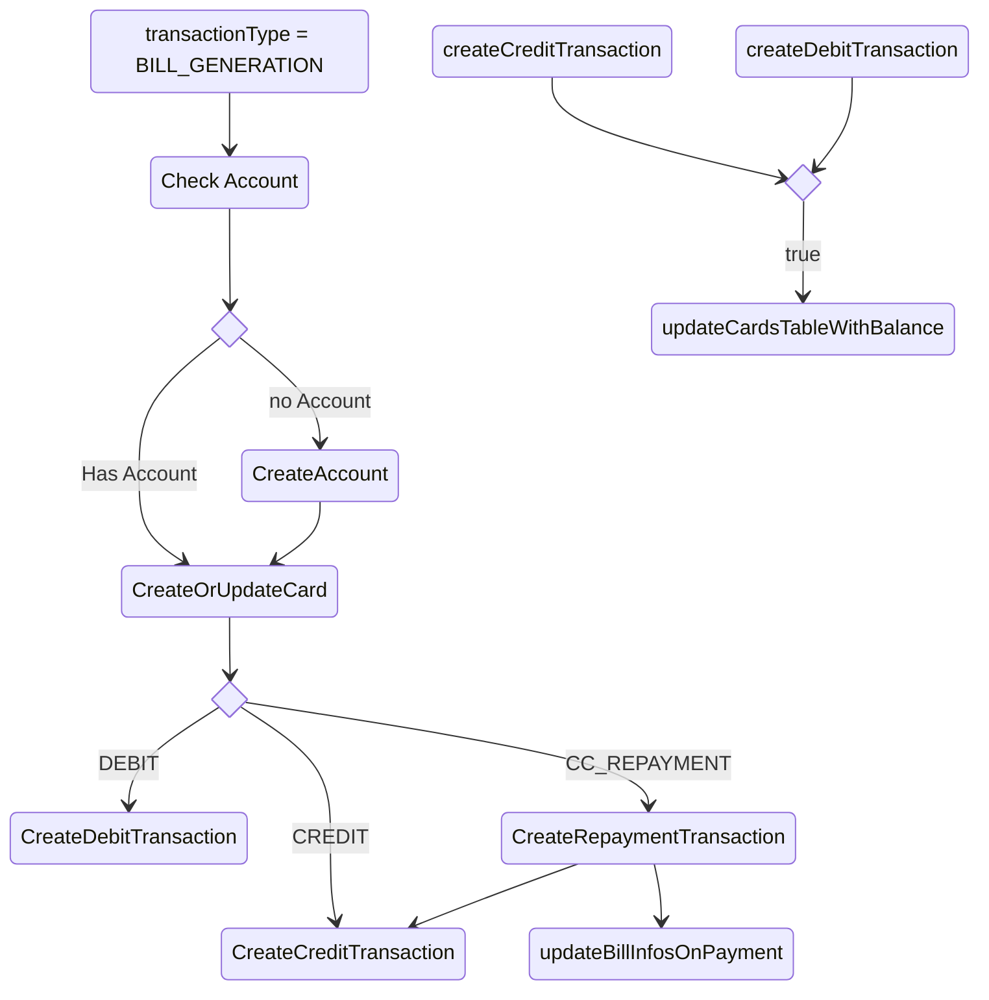

# Credit Card Processing

## Account Type
2. CREDITCARD

## BIll Transaction Types
1. CC_BALANCE = 'CC_BALANCE' Transaction that contain credit card balances only
2. CC_TRANSACTION = 'CC_TRANSACTION' - Along with messageType ( credit / debit ) chose txmAmount ( +ve  / -ve)
3.  CC_TRANSACTION_INFORMATION
4. CC_STATEMENT - Crdeit card statement. Sale as bill statement treatment. Extra field is minimum amount due
5.  CC_REMINDER Handle later
6.  CC_LOAN handle later
7.  CC_LOAN_EMI handle later

## MessageTypes
1. DEBIT  - CC_TRANSACTION + DEBIT - -ve transaction amount
2. CREDIT - CC_TRANSACTION + CREDIT - + ve transaction amount
3. CC_REPAYMENT - CC_TRANSACTION + CC_REPAYMENT = +ve transaction + credit card repayment(update bill_infos) + find matching banking transaction + change description to 'Credit Card Payment'
4. CC_STATEMENT - same as CC_STATEMENT in transactionType
## Processing
### CC_TRANSACTION

hasBalance: Has Balance flag usually set as part of smsRegex. However if the following keys has value, then hasBalance is true
1. available_credit_limit
2. total_credit_limit
3. outstanding_credit_limit

CreateOrUpdateBillInfos - Create a new entry here or update entry here depending on bill_date and account number

updateBillInfosOnPayment

1. Check if there is a bill Info in bills that is unpaid.
2. If no bill_ifos, then no changes
3. If bill_infos, then update paymentAt and return bill_infos_id

createBillTransaction
Since there is no description. Create a new description like ``${issureName} Bill Payment``
1. Check if there is a transaction for this amount in transaction ( might have got bank / credit card / wallet sms first)
2. If (1) is true, update the bill_infos_id, 
3. If no transaction, create one and link it to accountId and bill_infos_id

### CC_STATEMENT
Credit card statement generation - same as bill generation flow
1. Do the ususal check Account, card. Update Card with the relevant dates
2. Update bill_infos with the details of the statement. 

### CC_BALANCE
1. Update only cards table with the relevant information - available_credit and total_credit or outstanding_credit
