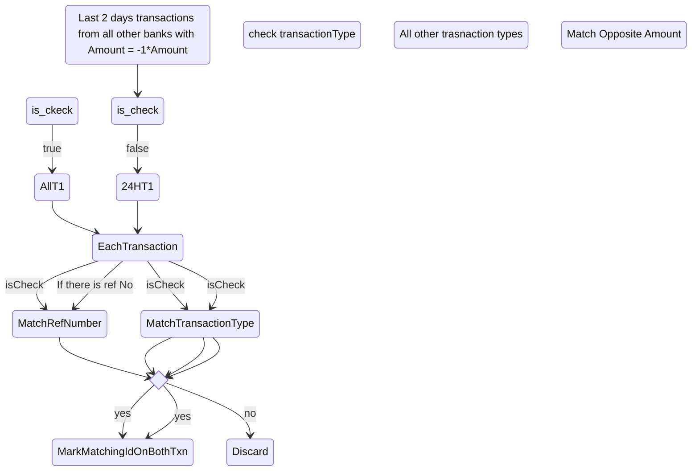

# Matching transactions
Need to identify matching transactions between all accounts

## Scenarios for matching transactions 
1. Duplicate transactions
2. Bank - to - bank transfers between own bank accounts
3. Bill Payments

### Duplicate transactions
1. Select all transactions for the last 5 mins / 10 mins with matching amounts( same sign)
2. If only one, then high chance of duplicate
4. Match transactionRefNumber ( if exists )
### Bank to bank transfers
Affected transaction types
1. UPI
2. NEFT
3. RTGS
4. IMPS
5. TRANSFER
6. CHECK

All transactions are instantaneous or at best within same day of transaction except for Check. 

Steps For a given Bank transaction
1. Get all Other Bank Transactions for the last 2 days. 
2. For all trasactionTypes use the last 24 hours transactions. For check use the last 2 days transactions. 
Matching Criteria

If at the end of all this there are multiple transactions, the choose the oldest transaction first.

### Bill Payments
This applies to all bill payment transactions TransactioType === 'BILL_PAYMENT' / 'CC_PAYMENT'

Same process as abovewith following exceptions
1. Transactions will be from all bank accounts
2. We will only march amounts - Bill amount payments are usually unique. 
3. Rarely will anyone pay bills using checks except for credit card maybe
mark billInfoId in Txn and txn_id in billInfos table. 
4. Change the transaction description to `${issuer.Name}` `${billInfo.billType display name}` `Payment`

## Pitfalls

1. User is doing multiple transfers with same amount using the same txnType - No refNo - Results in fifo - we can have a shorter lookback window time. 
2. Multiple ATM withdrawals etc. 